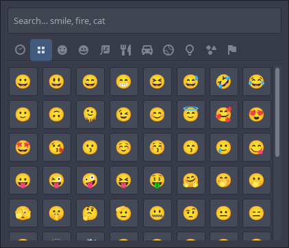
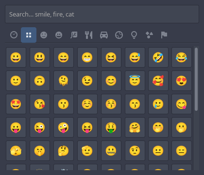
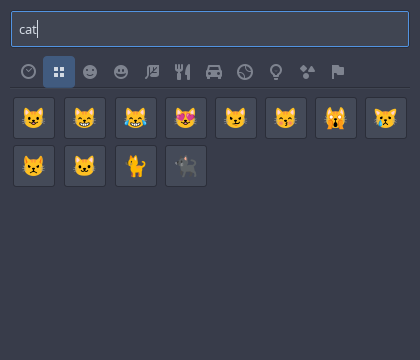
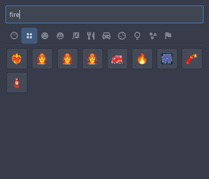
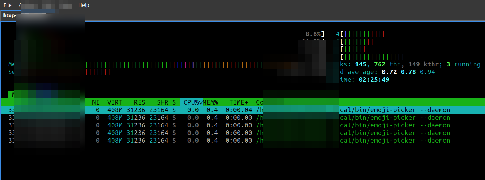
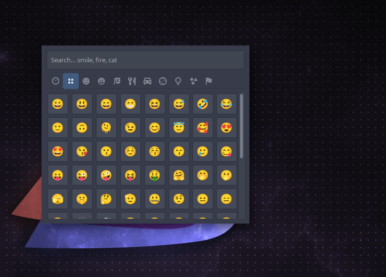

# emoji-picker

[](LICENSE)
[](https://github.com/habibiahmada/emoji-picker)
[](https://github.com/habibiahmada/emoji-picker)

**Win+.** → pick emoji → paste into the app you were already using.

A tiny **C + GTK3** Unicode emoji popup for Linux **X11** (Lubuntu/LXQt and friends).
No Electron. No Flatpak tax. A warm daemon so the shortcut feels instant.

<p align="center">
  
</p>

<p align="center">
  
  &nbsp;
  
  &nbsp;
  
</p>

## Why this exists

On a low-RAM desktop, “just install another Flatpak emoji app” is the wrong trade.
This project stays small, uses system GTK, and inserts into the **window that was
focused before** the picker opened — so you can keep multi-picking without fighting focus.

## Features

- Full Unicode set from official `emoji-test.txt` (refresh anytime)
- Search by English name (`smile`, `fire`, `cat`, …)
- Category tabs + recent history
- Popup near the pointer; skip taskbar; Esc / click-outside to dismiss
- Stays open for multi-pick (Windows-like)
- Inserts into the previously focused window by typing (no clipboard)
- Daemon + Unix socket: `emoji-picker --toggle` from a global shortcut

## Lightweight by design

Built for low-RAM X11 desktops — not another Electron/Flatpak resident.

| Metric | Value |
|--------|------:|
| Binary on disk | **~225 KB** |
| Emoji table (generated) | **~80 KB** · 1914 glyphs |
| Daemon RSS (idle) | **~30 MB** |
| Daemon RSS (popup open) | **~45 MB** |
| PSS idle / open (fairer share of GTK) | **~12 / ~18 MB** |

Compared to the earlier naïve UI (~157 MB RSS from thousands of live widgets), the
pool + pagination design keeps the warm daemon small enough to leave running.

<p align="center">
  
</p>

<p align="center"><sub>htop — <code>emoji-picker --daemon</code> at ~31 MB RES (username redacted)</sub></p>

## Screenshots

| Browse | Search |
|--------|--------|
|  |  |

Picker on the desktop (LXQt):



## Quick start

### Option A — GitHub Release (binary)

1. Download the latest `emoji-picker-*-linux-x86_64.tar.gz` from
   [Releases](https://github.com/habibiahmada/emoji-picker/releases).
2. Unpack and follow `INSTALL.txt` (copies binary to `~/.local/bin` + user systemd unit).

```bash
tar -xzf emoji-picker-*-linux-x86_64.tar.gz
cd emoji-picker-*-linux-x86_64
# see INSTALL.txt — then:
systemctl --user daemon-reload
systemctl --user enable --now emoji-picker.service
emoji-picker --toggle
```

Runtime packages (Debian/Ubuntu/Lubuntu):

```bash
sudo apt install libgtk-3-0 xdotool fonts-noto-color-emoji
```

### Option B — Build from source

**Build deps**

```bash
sudo apt install build-essential pkg-config libgtk-3-dev libx11-dev
```

**Runtime**

```bash
sudo apt install xdotool fonts-noto-color-emoji
```

Optional for fetching Unicode data: `curl`, `python3`.

**Install**

```bash
git clone https://github.com/habibiahmada/emoji-picker.git
cd emoji-picker
make data                    # download Unicode + generate src/generated/
make
make install                 # ~/.local/bin/emoji-picker + user systemd unit
systemctl --user daemon-reload
systemctl --user enable --now emoji-picker.service
```

If the window never appears under systemd (common on LXQt), pin display env:

```bash
mkdir -p ~/.config/systemd/user/emoji-picker.service.d
cat > ~/.config/systemd/user/emoji-picker.service.d/display.conf <<EOF
[Service]
Environment=DISPLAY=${DISPLAY}
Environment=XAUTHORITY=${XAUTHORITY:-$HOME/.Xauthority}
EOF
systemctl --user daemon-reload
systemctl --user restart emoji-picker.service
```

Then bind **Super+Period** — see [docs/SHORTCUTS.md](docs/SHORTCUTS.md).

Maintainer note: ship a release with `./scripts/release.sh 0.1.0 --publish`
(or push a `v*` tag and let [`.github/workflows/release.yml`](.github/workflows/release.yml) build it).

## Usage

| Command | Meaning |
|---------|---------|
| `emoji-picker` | Start (shows popup; binds socket if free) |
| `emoji-picker --daemon` | Start hidden (systemd) |
| `emoji-picker --toggle` | Show/hide (shortcut target) |
| `emoji-picker --show` / `--hide` | Explicit show or hide |

Esc or focus loss hides the window; the process keeps running.

## Update emoji database

```bash
make data    # https://www.unicode.org/Public/emoji/latest/emoji-test.txt
make && make install
systemctl --user restart emoji-picker.service
```

Pin a version: `UNICODE_VER=15.1 make data`.

## Docs (human-friendly)

| Doc | About |
|-----|--------|
| [docs/ARCHITECTURE.md](docs/ARCHITECTURE.md) | How the pieces fit |
| [docs/DEVELOPMENT.md](docs/DEVELOPMENT.md) | Day-to-day hacking |
| [docs/SHORTCUTS.md](docs/SHORTCUTS.md) | Win+. on LXQt + Openbox |
| [docs/SCREENSHOTS.md](docs/SCREENSHOTS.md) | How screenshots were taken |
| [docs/RELEASES.md](docs/RELEASES.md) | GitHub Releases publish/install |
| [`.agent/`](.agent/) | **All** AI-agent rules & context (Cursor, Antigravity, Kiro, Copilot, Claude, Graphify) |

## Project layout

```
emoji-picker/
├── .agent/                 # agent context + rules (single source of truth)
├── AGENTS.md / CLAUDE.md   # thin stubs → .agent/
├── README.md
├── Makefile
├── pack/emoji-picker.service
├── scripts/                # fetch + generate Unicode tables
├── src/
│   ├── main.c              # daemon, socket IPC
│   ├── popup.c             # GTK UI
│   ├── insert.c            # xdotool type into previous window
│   ├── history.c           # recent picks
│   └── generated/          # DO NOT hand-edit
└── docs/
    ├── screenshots/
    ├── ARCHITECTURE.md
    ├── DEVELOPMENT.md
    └── SHORTCUTS.md
```

## Uninstall

```bash
make uninstall
# optionally remove shortcut bindings from Openbox / LXQt
```

## Limitations

- **X11 only** (`xdotool` + GTK on X). Wayland needs a different insert path.
- Target app must accept simulated typing (`xdotool type`).
- Skin-tone variants are omitted from the grid (base glyphs) to keep RAM/UI light.

## Contributing

See [CONTRIBUTING.md](CONTRIBUTING.md) and [CODE_OF_CONDUCT.md](CODE_OF_CONDUCT.md).
Security reports: [SECURITY.md](SECURITY.md).

Agent / automation notes: [AGENTS.md](AGENTS.md).

## License

This project is released under the [MIT License](LICENSE).

Emoji names and glyphs are derived from Unicode’s `emoji-test.txt` (fetched at
`make data`). Unicode data files are subject to the
[Unicode License](https://www.unicode.org/license.txt).

## Author

**Habibi Ahmad Aziz**

- Portfolio: [habibiahmada.dev](https://habibiahmada.dev)
- Email: [contact@habibiahmada.dev](mailto:contact@habibiahmada.dev)
- GitHub: [@habibiahmada](https://github.com/habibiahmada)

## Thanks

Thanks to everyone who contributes to this project.

<p align="center">
  <a href="https://github.com/habibiahmada/emoji-picker/graphs/contributors">
    
  </a>
</p>

<p align="center"><sub>Made with care for low-RAM Linux desktops.</sub></p>

